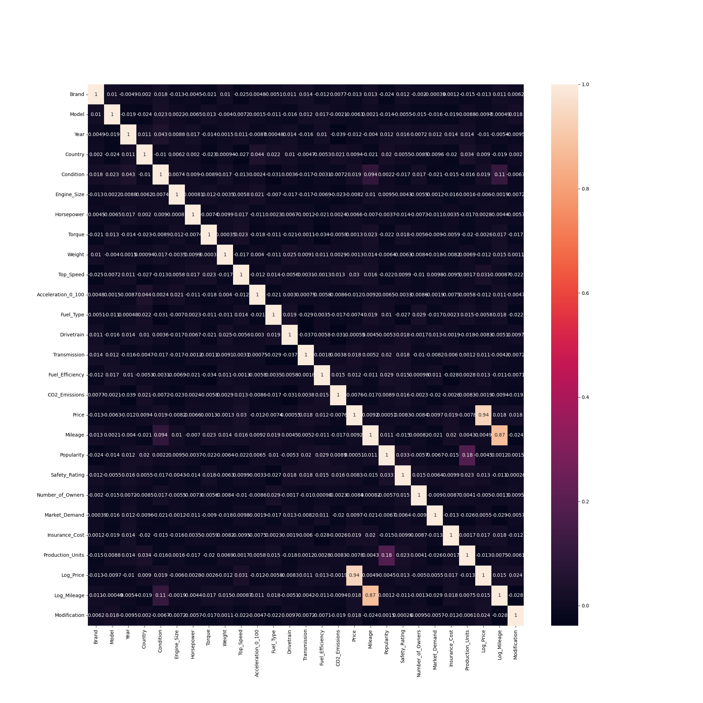
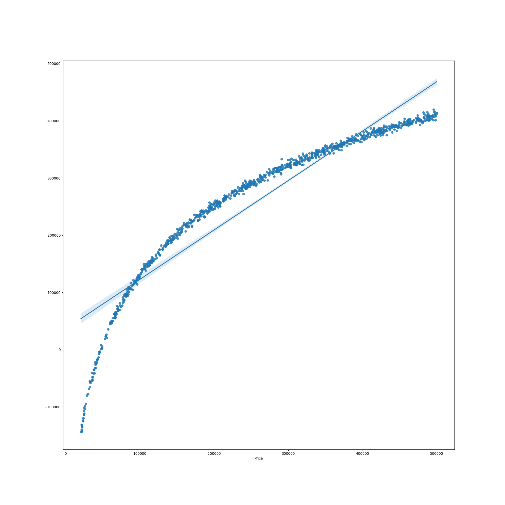
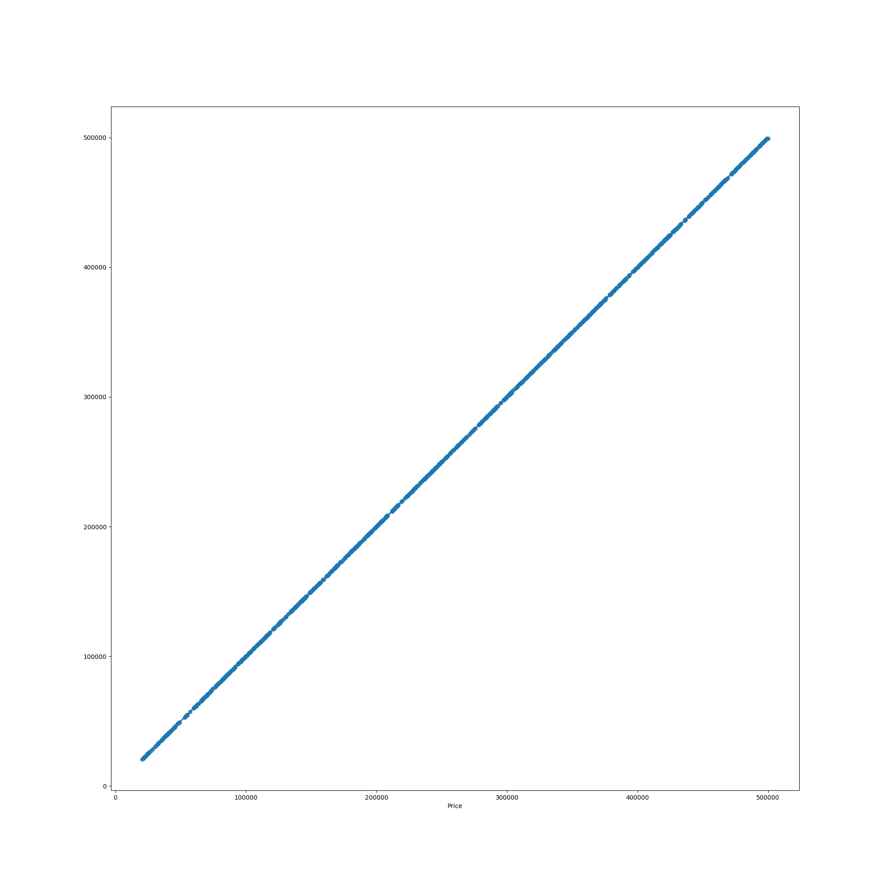
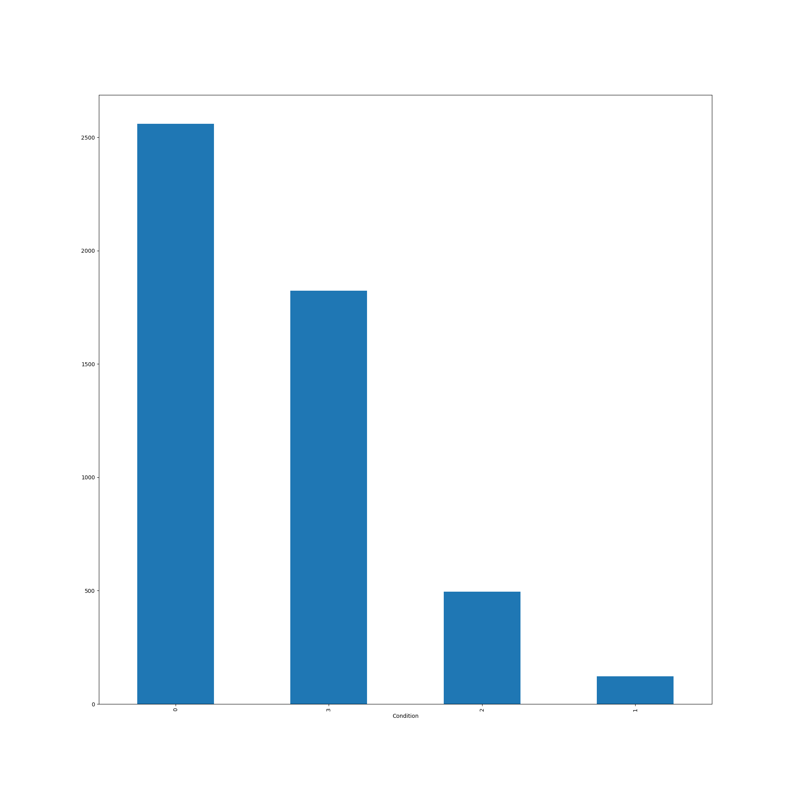

# 🚗 Elite Sports Cars Data Analysis

This project analyzes data on elite sports cars, including data cleaning, exploration, visualization, and model training for regression, classification, and clustering.

## 📠Project Structure

```plaintext
Elite Sports Cars Data Analysis/
├── 📂 data/
│   └── 📄 Elite Sports Cars in Data.csv
├── 📄 main.py
├── 📄 README.md
├── 📄 requirements.txt
├── 📂 visualize/
│   ├── 📂 classification/
│   │   ├── ğŸ–¼ï¸ condition.png
│   │   └── ğŸ–¼ï¸ popularity.png
│   ├── 📂 correlation/
│   │   └── ğŸ–¼ï¸ correlation.png
│   ├── 📂 regression/
│   │   ├── ğŸ–¼ï¸ linear_regression.png
│   │   └── ğŸ–¼ï¸ random_forest_regressor.png
│   └── 📂 single/
│       ├── ğŸ–¼ï¸ brand.png
│       ├── ğŸ–¼ï¸ condition.png
│       ├── ğŸ–¼ï¸ country.png
│       ├── ğŸ–¼ï¸ drivetrain.png
│       ├── ğŸ–¼ï¸ engine_size.png
│       ├── ğŸ–¼ï¸ fuel_type.png
│       ├── ğŸ–¼ï¸ horsepower.png
│       ├── ğŸ–¼ï¸ market_demand.png
│       ├── ğŸ–¼ï¸ model.png
│       ├── ğŸ–¼ï¸ price.png
│       ├── ğŸ–¼ï¸ top_speed.png
│       ├── ğŸ–¼ï¸ torque.png
│       ├── ğŸ–¼ï¸ transmission.png
│       ├── ğŸ–¼ï¸ weight.png
│       └── ğŸ–¼ï¸ year.png
```

## 📊 Data

The dataset `Elite Sports Cars in Data.csv` contains various features of elite sports cars, including:

- **Datetime**: Year
- **Categorical**: Brand, Model, Country, Condition, Modification, Fuel_Type, Drivetrain, Transmission, Popularity, Market_Demand
- **Numerical**: Engine_Size, Horsepower, Torque, Weight, Top_Speed, Acceleration_0_100, Fuel_Efficiency, CO2_Emissions, Price, Mileage, Safety_Rating, Number_of_Owners, Insurance_Cost, Production_Units, Log_Price, Log_Mileage

## 🧹 Data Cleaning

- Fill missing values in `Modification` with 'Unknown'
- Format `Year` using `pd.to_datetime`
- Encode categorical features using `LabelEncoder`

## 🔠Data Exploration

Visualizations are saved in the `visualize/single/` directory:

- Brand distribution
- Model distribution
- Country distribution
- Year distribution
- Engine_Size distribution
- Condition distribution
- Transmission distribution
- Market_Demand distribution
- Popularity distribution
- Fuel_Type distribution
- Drivetrain distribution
- Horsepower distribution
- Torque distribution
- Weight distribution
- Top_Speed distribution
- Price distribution

## 📈 Correlation

A correlation heatmap is saved in `visualize/correlation/correlation.png`.



## 🧠 Model Training

### 📉 Regression

- Linear Regression
- Random Forest Regressor

Visualizations are saved in the `visualize/regression/` directory:

- Linear Regression results

- Random Forest Regressor results


### 📊 Classification

- Random Forest Classifier for Popularity
- Random Forest Classifier for Condition

Visualizations are saved in the `visualize/classification/` directory:

- Popularity classification results

- Condition classification results


### 🔠Clustering

- KMeans clustering (implementation in progress)

## How to Run

1. Install the required libraries:

    ```sh
    pip install -r requirements.txt
    ```

2. Run the main script:

    ```sh
    python main.py
    ```

## 📜 License

This project is licensed under the MIT License.
