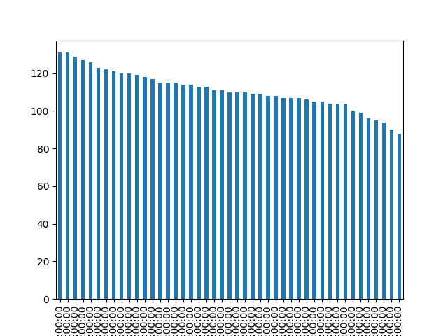

# 🚗 Elite Sports Cars Data Analysis

This project analyzes data on elite sports cars, including data cleaning, exploration, visualization, and model training for regression, classification, and clustering.

## 📁 Project Structure

```plaintext
Elite Sports Cars Data Analysis/
├── 📂 data/
│   └── 📄 Elite Sports Cars in Data.csv
├── 📄 main.py
├── 📄 README.md
├── 📄 requirements.txt
├── 📂 visualize/
│   ├── 📂 classification/
│   │   ├── 🖼️ condition.png
│   │   └── 🖼️ popularity.png
│   ├── 📂 correlation/
│   │   └── 🖼️ correlation.png
│   ├── 📂 regression/
│   │   ├── 🖼️ linear_regression.png
│   │   └── 🖼️ random_forest_regressor.png
│   └── 📂 single/
│       ├── 🖼️ brand.png
│       ├── 🖼️ condition.png
│       ├── 🖼️ country.png
│       ├── 🖼️ drivetrain.png
│       ├── 🖼️ engine_size.png
│       ├── 🖼️ fuel_type.png
│       ├── 🖼️ horsepower.png
│       ├── 🖼️ market_demand.png
│       ├── 🖼️ model.png
│       ├── 🖼️ price.png
│       ├── 🖼️ top_speed.png
│       ├── 🖼️ torque.png
│       ├── 🖼️ transmission.png
│       ├── 🖼️ weight.png
│       └── 🖼️ year.png
```

## 📊 Data

The dataset `Elite Sports Cars in Data.csv` contains various features of elite sports cars, including:

- **Datetime**:
  - **Year**: The year the car was manufactured.
- **Categorical**:
  - **Brand**: The brand of the car (e.g., Ferrari, Lamborghini).
  - **Model**: The specific model of the car.
  - **Country**: The country where the car was manufactured.
  - **Condition**: The condition of the car (e.g., New, Used).
  - **Modification**: Any modifications made to the car.
  - **Fuel_Type**: The type of fuel the car uses (e.g., Petrol, Diesel).
  - **Drivetrain**: The drivetrain configuration (e.g., AWD, RWD).
  - **Transmission**: The type of transmission (e.g., Manual, Automatic).
  - **Popularity**: The popularity rating of the car.
  - **Market_Demand**: The market demand for the car.
- **Numerical**:
  - **Engine_Size**: The size of the car's engine in liters.
  - **Horsepower**: The horsepower of the car.
  - **Torque**: The torque of the car in Nm.
  - **Weight**: The weight of the car in kilograms.
  - **Top_Speed**: The top speed of the car in km/h.
  - **Acceleration_0_100**: The time it takes for the car to accelerate from 0 to 100 km/h.
  - **Fuel_Efficiency**: The fuel efficiency of the car in km/l.
  - **CO2_Emissions**: The CO2 emissions of the car in g/km.
  - **Price**: The price of the car in USD.
  - **Mileage**: The mileage of the car in km.
  - **Safety_Rating**: The safety rating of the car.
  - **Number_of_Owners**: The number of previous owners of the car.
  - **Insurance_Cost**: The cost of insuring the car.
  - **Production_Units**: The number of units produced.
  - **Log_Price**: The logarithm of the price.
  - **Log_Mileage**: The logarithm of the mileage.

## 🧹 Data Cleaning

- Fill missing values in `Modification` with 'Unknown'.
- Format `Year` using `pd.to_datetime` to ensure it is in datetime format.
- Encode categorical features using `LabelEncoder` to convert them into numerical values suitable for machine learning algorithms.
- Handle missing values in numerical features by using appropriate imputation techniques (e.g., mean, median).
- Normalize numerical features to ensure they are on a similar scale.
- Remove any duplicate records to ensure data integrity.

## 🔍 Data Exploration

Visualizations are saved in the `visualize/single/` directory:

- **Brand distribution**: A bar chart showing the distribution of different car brands in the dataset.
  
- **Model distribution**: A bar chart showing the distribution of different car models in the dataset.
  
- **Country distribution**: A bar chart showing the distribution of cars by their country of manufacture.
  
- **Year distribution**: A histogram showing the distribution of car manufacturing years.
  
- **Engine_Size distribution**: A histogram showing the distribution of engine sizes.
  
- **Condition distribution**: A bar chart showing the distribution of car conditions (e.g., New, Used).
  
- **Transmission distribution**: A bar chart showing the distribution of transmission types (e.g., Manual, Automatic).
  
- **Market_Demand distribution**: A bar chart showing the distribution of market demand ratings.
  
- **Popularity distribution**: A bar chart showing the distribution of popularity ratings.
  
- **Fuel_Type distribution**: A bar chart showing the distribution of fuel types (e.g., Petrol, Diesel).
  
- **Drivetrain distribution**: A bar chart showing the distribution of drivetrain configurations (e.g., AWD, RWD).
  
- **Horsepower distribution**: A histogram showing the distribution of horsepower values.
  
- **Torque distribution**: A histogram showing the distribution of torque values.
  
- **Weight distribution**: A histogram showing the distribution of car weights.
  
- **Top_Speed distribution**: A histogram showing the distribution of top speeds.
  
- **Price distribution**: A histogram showing the distribution of car prices.
  

## 📈 Correlation

Correlation analysis helps in understanding the relationships between different numerical features in the dataset. A correlation heatmap is a visual representation of these relationships, where each cell in the heatmap shows the correlation coefficient between two features. The value of the correlation coefficient ranges from -1 to 1, where:

- **1** indicates a perfect positive correlation (as one feature increases, the other feature also increases).
- **-1** indicates a perfect negative correlation (as one feature increases, the other feature decreases).
- **0** indicates no correlation (the features do not have any linear relationship).

The correlation heatmap for the dataset is saved in `visualize/correlation/correlation.png`.


In the heatmap:

- **High positive correlations** are shown in darker shades of blue.
- **High negative correlations** are shown in darker shades of red.
- **Low or no correlations** are shown in lighter shades.

This heatmap helps in identifying which features are strongly correlated with each other, which can be useful for feature selection and understanding the underlying structure of the data.

## 🧠 Model Training

### 📉 Regression

Regression analysis is used to predict a continuous target variable based on one or more predictor variables. In this project, we have used two regression models:

- **Linear Regression**: A simple linear approach to modeling the relationship between the target variable and predictor variables. It assumes a linear relationship between the input features and the target variable.
- **Random Forest Regressor**: An ensemble learning method that uses multiple decision trees to improve the accuracy and robustness of the predictions. It reduces overfitting by averaging the results of multiple trees.

Visualizations are saved in the `visualize/regression/` directory:

- **Linear Regression results**: This visualization shows the predicted values versus the actual values for the target variable using the Linear Regression model. It helps in understanding how well the model fits the data.
  
- **Random Forest Regressor results**: This visualization shows the predicted values versus the actual values for the target variable using the Random Forest Regressor model. It helps in understanding the performance of the ensemble model and its ability to capture complex relationships in the data.
  

### 📊 Classification

Classification analysis is used to predict categorical target variables based on one or more predictor variables. In this project, we have used the Random Forest Classifier for two classification tasks:

- **Random Forest Classifier for Popularity**: This model predicts the popularity rating of a car based on various features. The Random Forest Classifier is an ensemble learning method that uses multiple decision trees to improve the accuracy and robustness of the predictions. It reduces overfitting by averaging the results of multiple trees.
- **Random Forest Classifier for Condition**: This model predicts the condition of a car (e.g., New, Used) based on various features. Similar to the popularity classifier, it uses the Random Forest Classifier to enhance prediction accuracy and robustness.

Visualizations are saved in the `visualize/classification/` directory:

- **Popularity classification results**: This visualization shows the performance of the Random Forest Classifier in predicting the popularity rating of cars. It includes metrics such as accuracy, precision, recall, and the confusion matrix to evaluate the model's performance.
  
- **Condition classification results**: This visualization shows the performance of the Random Forest Classifier in predicting the condition of cars. It includes metrics such as accuracy, precision, recall, and the confusion matrix to evaluate the model's performance.
  

### 🔍 Clustering

- KMeans clustering (implementation in progress)

## How to Run

1. Install the required libraries:

    ```sh
    pip install -r requirements.txt
    ```

2. Run the main script:

    ```sh
    python main.py
    ```

## 📜 License

This project is licensed under the MIT License.
